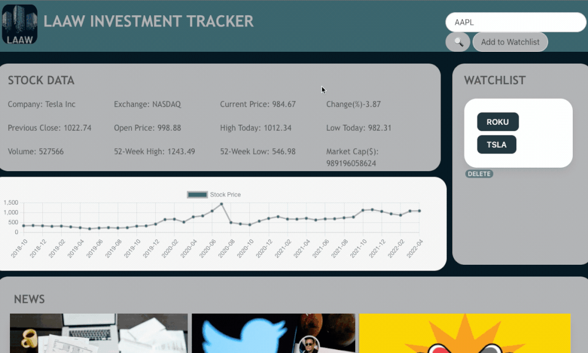

# Portfolio-2

## **Deployed Link**

Please click on the following link to be navigated to the portfolio: https://luccaloopz.github.io/portfolio-2/

## **Contact Info**

* `Email:` luccamartins2012@gmail.com
* `GitHub Profile:` https://github.com/luccaloopz

## **Languages Used**

* HTML
* CSS

## **Description**

The purpose of this project was to create a portfolio showcasing some of my newer coding projects. The site includes an "About Me" section where the visitor will find a picture of myself as well as a small blurb describing my professional journey up until the creation of this portfolio. The site also includes a "Contact Info" section as well as a navigation bar at the top of the site that includes a link my GitHub profile, LinkedIn profile, and Resume. 

## **Application**

Picture of the heading as well as the nav bar which includes hyperlinks to other websites, other parts of the page, and a contact info popup.


Picture of the project tiles. They include the title of the project, a brief description, and a link to the GitHub repo.


## **Important Code Snippets**

Below is how I created each project tile. Wrapping the `` tags in `<a>` tags allowed for the gif images to act as hyperlinks. Throw in some css opacity stylings along with some help from Bootstrap, the My Projects section of the portfolio was created. 

```HTML
<div class="col-lg pictures">
    <a class="imgcontainer" href="https://atmason90.github.io/laaw-investment-tracker/" target="_blank">
        <p class="picCaption">Investment Tracker ~ stock data and news at your fingertips</p>
    </a>
    <a href="https://github.com/luccaloopz/laaw-investment-tracker" target="_blank">
        <p class="picCaption">GitHub Repo Link</p>
    </a>
</div>
```

## **LICENSE**

MIT License

Copyright (c) 2022 Lucca Martins

Permission is hereby granted, free of charge, to any person obtaining a copy of this software and associated documentation files (the "Software"), to deal in the Software without restriction, including without limitation the rights to use, copy, modify, merge, publish, distribute, sublicense, and/or sell copies of the Software, and to permit persons to whom the Software is furnished to do so, subject to the following conditions:

The above copyright notice and this permission notice shall be included in all copies or substantial portions of the Software.

THE SOFTWARE IS PROVIDED "AS IS", WITHOUT WARRANTY OF ANY KIND, EXPRESS OR IMPLIED, INCLUDING BUT NOT LIMITED TO THE WARRANTIES OF MERCHANTABILITY, FITNESS FOR A PARTICULAR PURPOSE AND NONINFRINGEMENT. IN NO EVENT SHALL THE AUTHORS OR COPYRIGHT HOLDERS BE LIABLE FOR ANY CLAIM, DAMAGES OR OTHER LIABILITY, WHETHER IN AN ACTION OF CONTRACT, TORT OR OTHERWISE, ARISING FROM, OUT OF OR IN CONNECTION WITH THE SOFTWARE OR THE USE OR OTHER DEALINGS IN THE SOFTWARE.